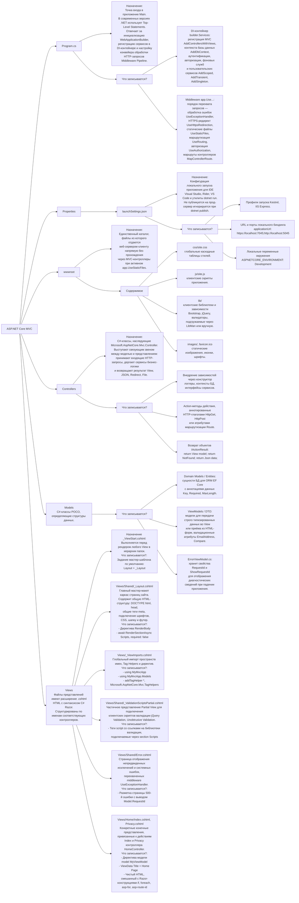

```mermaid
graph LR
    ROOT["ASP.NET Core MVC"]

    %% 1. Program.cs
    ROOT --> PROG["Program.cs"]
    PROG --> PROG_N["Назначение:<br>Точка входа в приложение Main.<br>В современных версиях .NET использует Top-Level Statements.<br>Отвечает за инициализацию WebApplicationBuilder,<br>регистрацию сервисов в DI-контейнере и настройку<br>конвейера обработки HTTP-запросов Middleware Pipeline."]
    PROG --> PROG_Z["Что записывается?"]
    PROG_Z --> PROG_DI["DI-контейнер builder.Services:<br>регистрация MVC AddControllersWithViews,<br>контекста базы данных AddDbContext,<br>аутентификации, авторизации, фоновых служб<br>и пользовательских сервисов AddScoped, AddTransient, AddSingleton."]
    PROG_Z --> PROG_MW["Middleware app.Use...:<br>порядок перехвата запросов —<br>обработка ошибок UseExceptionHandler,<br>HTTPS-редирект UseHttpsRedirection,<br>статические файлы UseStaticFiles,<br>маршрутизация UseRouting,<br>авторизация UseAuthorization,<br>маршруты контроллеров MapControllerRoute."]

    %% 2. Properties
    ROOT --> PROP["Properties"]
    PROP --> LS["launchSettings.json"]
    LS --> LS_N["Назначение:<br>Конфигурация локального запуска приложения для IDE<br>Visual Studio, Rider, VS Code и утилиты dotnet run.<br>Не публикуется на прод-сервер игнорируется при dotnet publish."]
    LS --> LS_Z["Что записывается?"]
    LS_Z --> LS_Z1["Профили запуска Kestrel, IIS Express."]
    LS_Z --> LS_Z2["URL и порты локального биндинга<br>applicationUrl: https://localhost:7045;http://localhost:5045"]
    LS_Z --> LS_Z3["Локальные переменные окружения<br>ASPNETCORE_ENVIRONMENT: Development"]

    %% 3. wwwroot
    ROOT --> WWW["wwwroot"]
    WWW --> WWW_N["Назначение:<br>Единственный каталог, файлы из которого отдаются<br>веб-сервером клиенту напрямую без прохождения<br>через MVC-контроллеры при активном app.UseStaticFiles."]
    WWW --> WWW_S["Содержимое"]
    WWW_S --> WWW_CSS["css/site.css<br>глобальные каскадные таблицы стилей."]
    WWW_S --> WWW_JS["js/site.js<br>клиентские скрипты приложения."]
    WWW_S --> WWW_LIB["lib/<br>клиентские библиотеки и зависимости<br>Bootstrap, jQuery, валидаторы,<br>подгружаемые через LibMan или вручную."]
    WWW_S --> WWW_IMG["images/, favicon.ico<br>статические изображения, иконки, шрифты."]

    %% 4. Controllers
    ROOT --> CTRL["Controllers"]
    CTRL --> CTRL_N["Назначение:<br>C#-классы, наследующие Microsoft.AspNetCore.Mvc.Controller.<br>Выступают связующим звеном между моделью и представлением:<br>принимают входящие HTTP-запросы, дергают сервисы бизнес-логики<br>и возвращают результат View, JSON, Redirect, File."]
    CTRL --> CTRL_Z["Что записывается?"]
    CTRL_Z --> CTRL_Z1["Внедрение зависимостей через конструктор<br>логгеры, контексты БД, интерфейсы сервисов."]
    CTRL_Z --> CTRL_Z2["Action-методы действия, аннотированные<br>HTTP-глаголами HttpGet, HttpPost<br>или атрибутами маршрутизации Route."]
    CTRL_Z --> CTRL_Z3["Возврат объектов IActionResult:<br>return View model; return NotFound; return Json data;"]

    %% 5. Models
    ROOT --> MOD["Models<br>C#-классы POCO, определяющие структуры данных."]
    MOD --> MOD_Z["Что записывается?"]
    MOD_Z --> MOD_Z1["Domain Models / Entities:<br>сущности БД для ORM EF Core<br>с аннотациями данных Key, Required, MaxLength."]
    MOD_Z --> MOD_Z2["ViewModels / DTO:<br>модели для передачи строго типизированных данных во View<br>или приёма из HTML-форм, валидационные атрибуты EmailAddress, Compare."]
    MOD_Z --> MOD_Z3["ErrorViewModel.cs:<br>хранит свойства RequestId и ShowRequestId<br>для отображения диагностических сведений при падении приложения."]

    %% 6. Views
    ROOT --> VIEWS["Views<br>Файлы представлений имеют расширение .cshtml<br>HTML с синтаксисом C# Razor.<br>Структурированы по именам соответствующих контроллеров."]
    VIEWS --> VS["Назначение _ViewStart.cshtml:<br>Выполняется перед рендером любого View в иерархии папок.<br>Что записывается?: Задание мастер-шаблона по умолчанию:<br>Layout = _Layout"]
    VIEWS --> V_LAY["Views/Shared/_Layout.cshtml<br>Главный мастер-макет каркас страниц сайта.<br>Содержит общую HTML-структуру: DOCTYPE html, head,<br>общие теги meta, подключение шрифтов, CSS, шапку и футер.<br>Что записывается?:<br>- Директива RenderBody<br>- await RenderSectionAsync Scripts, required: false"]
    VIEWS --> V_IMP["Views/_ViewImports.cshtml<br>Глобальный импорт пространств имен, Tag Helpers и директив.<br>Что записывается?:<br>- using MyMvcApp<br>- using MyMvcApp.Models<br>- addTagHelper *, Microsoft.AspNetCore.Mvc.TagHelpers"]
    VIEWS --> V_VAL["Views/Shared/_ValidationScriptsPartial.cshtml<br>Частичное представление Partial View для подключения<br>клиентских скриптов валидации jQuery Validation, Unobtrusive Validation.<br>Что записывается?:<br>- Теги script со ссылками на библиотеки валидации,<br>подключаемые через section Scripts"]
    VIEWS --> V_ERR["Views/Shared/Error.cshtml<br>Страница отображения непредвиденных исключений и системных ошибок,<br>перехваченных middleware UseExceptionHandler.<br>Что записывается?:<br>- Разметка страницы 500-й ошибки с выводом Model.RequestId"]
    VIEWS --> V_HOME["Views/Home/Index.cshtml, Privacy.cshtml<br>Конкретные конечные представления, привязанные к действиям<br>Index и Privacy контроллера HomeController.<br>Что записывается?:<br>- Директива модели model MyViewModel<br>- ViewData Title = Home Page<br>- Чистый HTML, смешанный с Razor-конструкциями if, foreach, asp-for, asp-route-id"]
```
