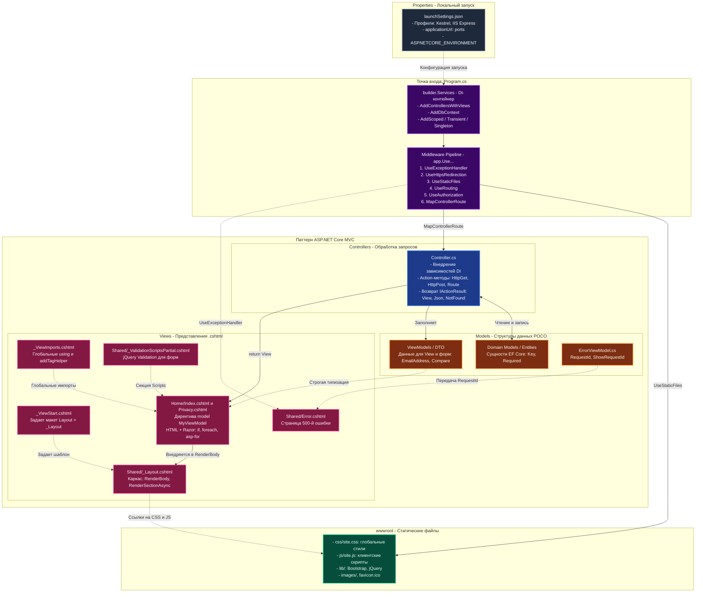

```mermaid
graph TD
    subgraph IDE ["Properties - Локальный запуск"]
        LS["launchSettings.json<br>- Профили: Kestrel, IIS Express<br>- applicationUrl: ports<br>- ASPNETCORE_ENVIRONMENT"]
    end

    subgraph AppRoot ["Точка входа: Program.cs"]
        DI["builder.Services - DI-контейнер<br>- AddControllersWithViews<br>- AddDbContext<br>- AddScoped / Transient / Singleton"]
        MW["Middleware Pipeline - app.Use...<br>1. UseExceptionHandler<br>2. UseHttpsRedirection<br>3. UseStaticFiles<br>4. UseRouting<br>5. UseAuthorization<br>6. MapControllerRoute"]
        DI --> MW
    end

    subgraph Static ["wwwroot - Статические файлы"]
        WWW["- css/site.css: глобальные стили<br>- js/site.js: клиентские скрипты<br>- lib/: Bootstrap, jQuery<br>- images/, favicon.ico"]
    end

    subgraph MVC ["Паттерн ASP.NET Core MVC"]
        subgraph C ["Controllers - Обработка запросов"]
            CTRL["Controller.cs<br>- Внедрение зависимостей DI<br>- Action-методы: HttpGet, HttpPost, Route<br>- Возврат IActionResult: View, Json, NotFound"]
        end

        subgraph M ["Models - Структуры данных POCO"]
            DOM["Domain Models / Entities<br>Сущности EF Core: Key, Required"]
            VM["ViewModels / DTO<br>Данные для View и форм: EmailAddress, Compare"]
            ERRM["ErrorViewModel.cs<br>RequestId, ShowRequestId"]
        end

        subgraph V ["Views - Представления .cshtml"]
            VI["_ViewImports.cshtml<br>Глобальные using и addTagHelper"]
            VS["_ViewStart.cshtml<br>Задает макет Layout = _Layout"]
            LAY["Shared/_Layout.cshtml<br>Каркас: RenderBody, RenderSectionAsync"]
            VAL["Shared/_ValidationScriptsPartial.cshtml<br>jQuery Validation для форм"]
            ERRV["Shared/Error.cshtml<br>Страница 500-й ошибки"]
            PAGE["Home/Index.cshtml и Privacy.cshtml<br>Директива model MyViewModel<br>HTML + Razor: if, foreach, asp-for"]
        end
    end

    LS -.->|"Конфигурация запуска"| DI
    MW -->|"UseStaticFiles"| WWW
    MW -->|"MapControllerRoute"| CTRL
    MW -.->|"UseExceptionHandler"| ERRV

    CTRL <-->|"Чтение и запись"| DOM
    CTRL -->|"Заполняет"| VM
    CTRL -->|"return View"| PAGE

    VM -.->|"Строгая типизация"| PAGE
    ERRM -.->|"Передача RequestId"| ERRV

    VI -.->|"Глобальные импорты"| PAGE
    VS -.->|"Задает шаблон"| LAY
    PAGE -->|"Внедряется в RenderBody"| LAY
    VAL -.->|"Секция Scripts"| PAGE
    LAY -.->|"Ссылки на CSS и JS"| WWW

    classDef config fill:#1e293b,stroke:#64748b,stroke-width:2px,color:#f8fafc;
    classDef entry fill:#3b0764,stroke:#a855f7,stroke-width:2px,color:#faf5ff;
    classDef static fill:#064e3b,stroke:#10b981,stroke-width:2px,color:#ecfdf5;
    classDef controller fill:#1e3a8a,stroke:#3b82f6,stroke-width:2px,color:#eff6ff;
    classDef model fill:#7c2d12,stroke:#f97316,stroke-width:2px,color:#fff7ed;
    classDef view fill:#831843,stroke:#ec4899,stroke-width:2px,color:#fdf2f8;

    class LS config;
    class DI,MW entry;
    class WWW static;
    class CTRL controller;
    class DOM,VM,ERRM model;
    class VI,VS,LAY,VAL,ERRV,PAGE view;
```
